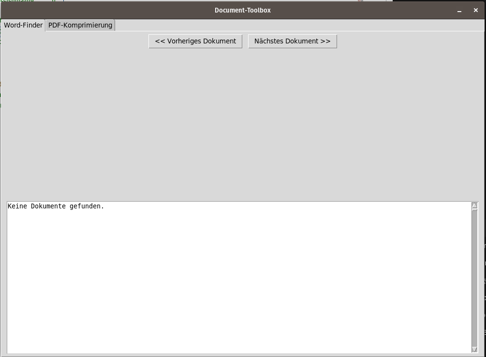
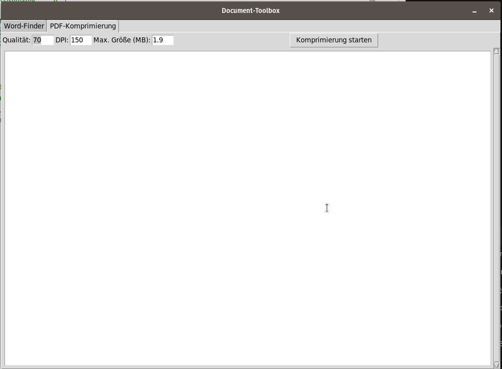

# Document-Toolbox

Eine modulare Desktop-Anwendung zur interaktiven Analyse von `.docx`-Dateien und intelligenten PDF-Komprimierungen – mit schöner Benutzeroberfläche in mehreren Reitern.


---

## Features

**Word-Finder (DOCX)**
- Finde doppelte Wörter in `.docx`-Dateien
- Ersetze Wörter direkt im Text
- Markiere Füllwörter dauerhaft
- Satzkontext anzeigen
- Synonym-Vorschläge via `openthesaurus.de`

**PDF-Komprimierung**
- Zielgröße einstellbar (z. B. 1,9 MB)
- Optimierung via Qualität & DPI
- Strukturierte Gruppenkompression
- Lesezeichen (Bookmarks) aus Markdown-Inhaltsverzeichnis

---

## Ordnerstruktur

```bash
Document-Toolbox/
├── main.py                    # GUI mit Reitern
├── word_finder_ui.py          # Word-Finder Oberfläche
├── compress_pdf_ui.py         # PDF-Komprimierung GUI
├── compress_pdf_group.py      # Kern-Logik für PDF-Verarbeitung
├── Word/
│   ├── Fuellwoerter.txt       # Benutzerdefinierte Füllwörter
│   └── *.docx                 # Word-Dokumente zur Analyse
├── Pdf/
│   ├── Inhaltsverzeichnis.md  # Markdown-Struktur für Bookmarks
│   ├── tmp_pdf_pages/         # Temporäre Seiten während der Kompression
│   ├── *.pdf                  # Quell-PDFs
│   └── Anlagen.pdf            # Ergebnis (automatisch erzeugt)
├── pictures/
│   ├── Screenshot_Word-Finder.png
│   └── Screenshot_PDF-Komprimierung.png
├── requirements.txt
├── Dockerfile
├── README.md
└── LICENSE
```

---

## Installation (lokal)

### Python-Abhängigkeiten

```bash
pip install -r requirements.txt
```

## Anwendung starten

```bash
python3 main.py
```

Es öffnet sich ein Fenster mit zwei Reitern:

- **Word-Finder** (für `.docx`)  
  
- **PDF-Komprimierung** (für strukturierte `*.pdf`)  
  

---

## Docker

```bash
docker build -t document-toolbox .
xhost +local:root  # Nur auf Linux mit GUI nötig
docker run --rm -e DISPLAY=$DISPLAY -v /tmp/.X11-unix:/tmp/.X11-unix document-toolbox
```

---

## Beispiel: Inhaltsverzeichnis für Bookmarks (Markdown)

```markdown
- Dateien Typ 1:
  - 123.pdf
  - 456.pdf
- Dateien Typ 2n:
  - 789.pdf
  - 012.pdf
- Dateien Typ 3:
  - 345.pdf
  - 678.pdf
```

---

## Lizenz

Apache License 2.0 – siehe [`LICENSE`](LICENSE)